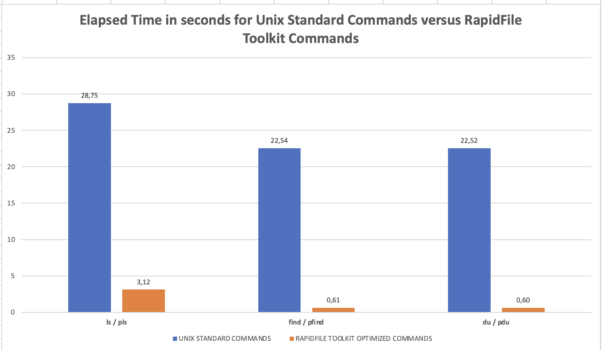
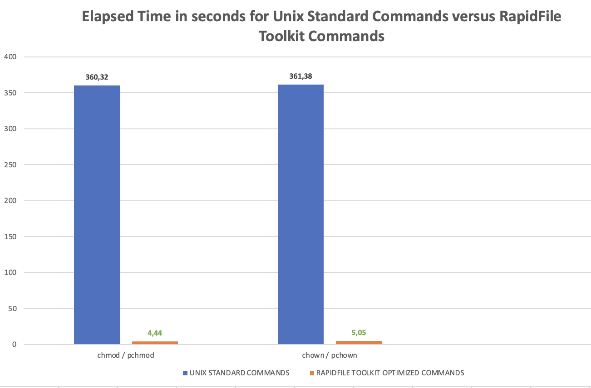
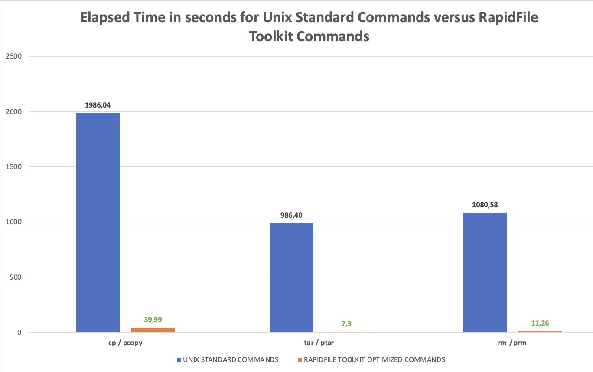

# PURE STORAGE RAPID FILE TOOLKIT DEMO

## INTRODUCTION

Data Engineers and Data Scientists day to day tasks require running complex data pipelines to test data ingestion and 
preparation processes from data coming from very diverse sources (Databases, WebScaraping, Feature stores…) before training 
a model.

In this context, accelerating these iterative processes and tasks may be crucial to improve the time to market of a model
that will help to solve a business need of their company.

With our distributed architecture coupled with our optimized meta-data engine, we provide a powerful and simple toolkit 
that will help to massively improve the data pipelines by reducing the time to use some Linux commands on very large datasets 
such as find, ls, chown, chmod… in several ways:

- **Time Efficiency**: Accelerating these commands can dramatically reduce the time it takes to perform routine tasks. 
      For example, speeding up find can greatly decrease the time required to locate specific files or directories within a large directory tree. 
      Similarly, faster ls commands can quickly list the contents of directories, aiding in navigation and file management.

- **Productivity**: With faster command execution, data engineers can complete tasks more efficiently, leading to increased productivity. 
      This is particularly beneficial for tasks that involve repetitive operations, such as searching for files or changing permissions across multiple files or directories that can also be automated and run many times.

- **Resource Optimization** : Accelerating commands can help optimize resource utilization on Unix systems. 
      For instance, improving the performance of find can reduce the system load caused by recursive directory traversals, thereby freeing up system resources for other tasks.

- **Improved Workflow** : Faster command execution contributes to a smoother workflow, allowing data engineers to focus on more critical aspects of their work. 
      This can enhance overall job satisfaction and job performance.

- **Real-Time Data Processing** : In scenarios where real-time data processing is crucial, such as in streaming data pipelines or time-sensitive analytics, accelerated commands enable data engineers to quickly access and manipulate data without experiencing delays.

- **Responsive System Interaction** : Accelerated commands enhance the responsiveness of the Unix system's command-line interface, providing a seamless user experience. 
       This is especially valuable for data engineers who frequently interact with the command line as part of their daily workflow.

Overall, accelerating commands like find, ls, chown, chmod, tar, cp… offers tangible benefits for data engineers working with Unix systems, ranging from time savings and increased productivity to improved resource utilization and system responsiveness. These optimizations contribute to a more efficient and effective workflow, ultimately enhancing the data engineer's ability to manage and manipulate data efficiently.

## DATA PREPARATION WITH VDBENCH

1. Install vdbench on your Linux system

2. Use the provided vdbench configuration file 'rapidfile-datascience-folder.vdb' to create a test file tree with 500k 4KB files :

```
     /datascience-folder
            ├── dir1                        ===> 1000 folders
            │   ├── vdb.1_1000.dir          ===> 100 files
            │   │   ├── vdb_f99900.file
            │   │   ├── vdb_f99901.file
            │   │   ├── vdb_f99902.file
            │   │   ├── vdb_f99903.file
            .........
            │   │   ├── vdb_f99998.file
            │   │   └── vdb_f99999.file
            │   ├── vdb.1_100.dir           ===> 100 files
            │   │   ├── vdb_f9900.file
            │   │   ├── vdb_f9901.file
            .........
            │   │   ├── vdb_f9998.file
            │   │   └── vdb_f9999.file
            │   ├── vdb.1_101.dir
            │   │   ├── vdb_f10000.file
            │   │   ├── vdb_f10001.file
            .........
```

You will have 5 root folders with each 1000 sub folders.
Each sub folder will contain 100 4KB files.

## RAPID FILE TOOLKIT INSTALLATION

1. Access your support.purestorage.com account and search for RApidFile Toolkit in order to download bianries

2. Install the rpm in your Linux system :

    % sudo rpm -Uv rapidfile-toolkit-2.1.1-1.x86_64.rpm

## RAPID FILE TOOLKIT AUTOMATED TESTS

If you want to automate all tests comaring standr Linux commands versus RapidFile Toolkit commands, simply run the 
rft_automated_tests.sh script and look at the outpout that should look like :

    % ./rft_automated_tests.sh

    % more rft_automated_tests_20240205_213852.txt

## DEMO

A recorded demo is also available to show the benefits of the RapidFile Toolkit coupled with Flashblade.

## RESULTS ON OUR PARIS LAB

### LS/PLS, FIND/PFIND and DU/PDU


### HMOD/PCHMOD, CHOWN/PCHMOD


### CP/PCOPY, TRA/PTAR and RM/PRM




